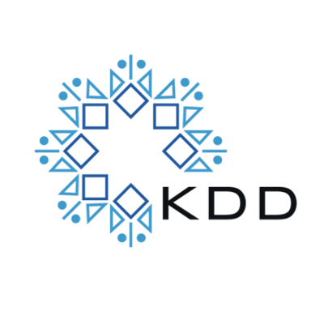
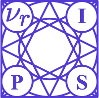
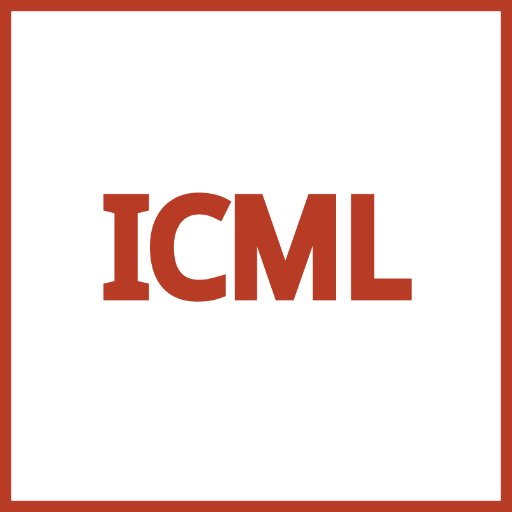
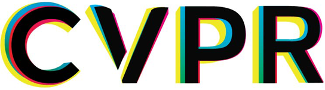

# paper-survey

  
  

  
  
  

 

データマイニング分野の論文(KDD, ICDMなど)や 
ニューラルネットワークについてのサーベイをまとめるレポジトリ。

# Contents
* [Article Summaries](https://github.com/Kaniikura/paper-survey/issues)
  * 論文まとめをIssueで管理しています。
* Conference Related Papers
  * issueでまとめた論文を学会ごとに索引できるようにしています。
  * [KDD](https://github.com/Kaniikura/paper-survey/projects/1)
  * [ICDM](https://github.com/Kaniikura/paper-survey/projects/2)
